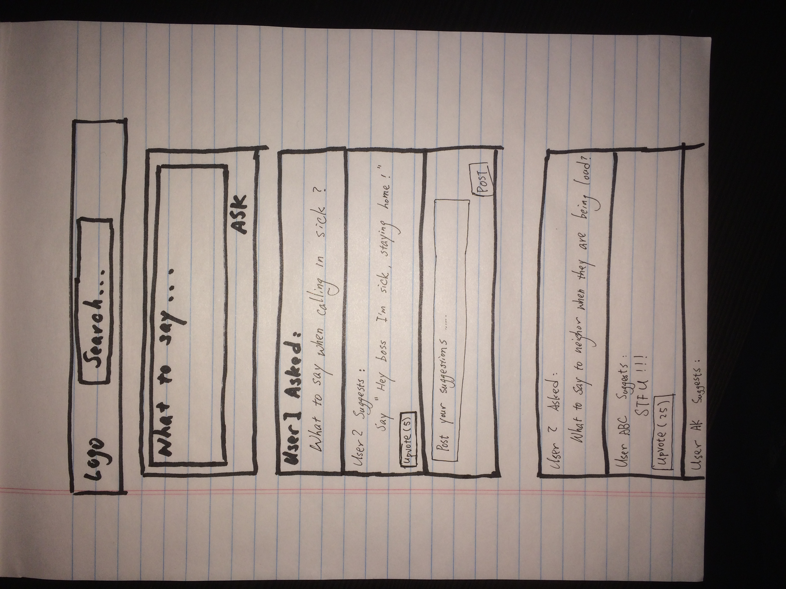
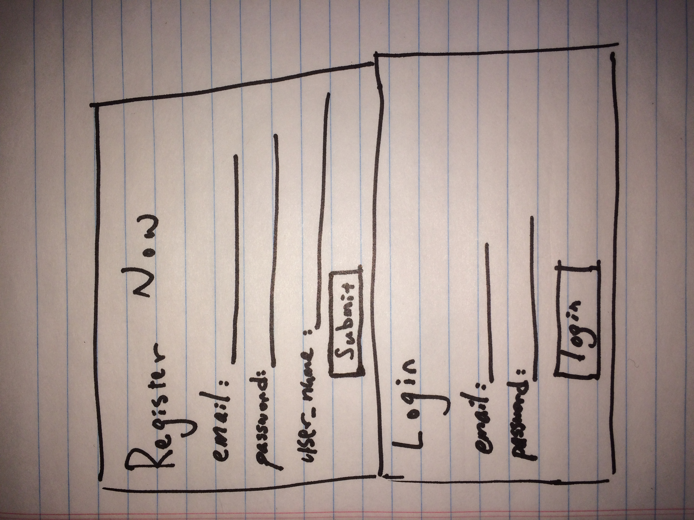
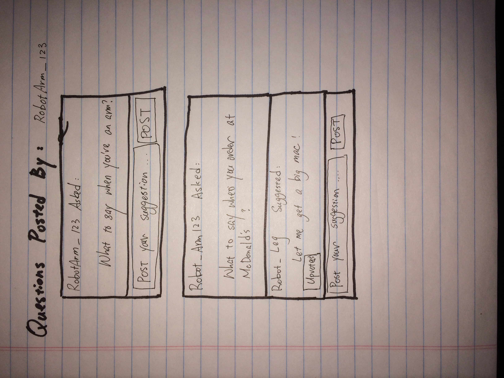
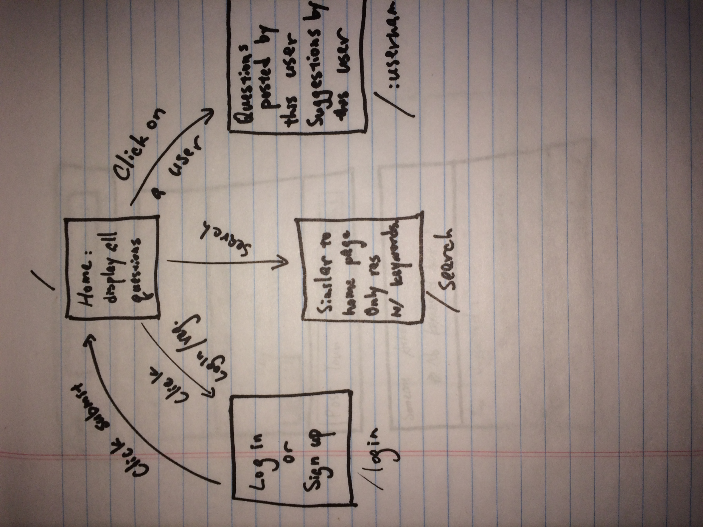

# What Now!

## Overview

What Now lets users post questions about what to say in certain situations and other users posts their suggestinos.
User can also search for questions that has been asked and answered.


## Data Model


The application will store Users, Questions and Suggestions

* users can have multiple Questions and Suggestions to other's questions (via references), each user also has points(you get points by posting suggestions, and more by getting likes on your suggestions)
* each Question can have multiple Suggestions (by references), the _id of the user that posted it.
* each Suggestion has a list of Users that 'liked' it (by reference), the _id of the user that posted it, number of likes, a reference to the question this suggestion was made for.


An Example User:

```javascript
{
  username: "i_have_so_much_questions",
  hash: // a password hash,
  questions: // an array of references to Question documents
  suggestions: //an array of references to Suggestion documents I've made
  points: 0
}
```

An Example Question:

```javascript
{
  text: "What To Say when you want to call in sick"
  user: // a reference to a User that posted the question
  suggestions: //an array of references to Suggestions documents made under this Question
  createdAt: // timestamp
}
```

An Example Suggestion:

```javascript
{
  text: "I am taking a sick day. I plan on seeing you tomorrow. I will let you know if that changes."
  user: // a reference to a User that posted the suggestion
  likes: //number of likes for this suggestion
  question: //a reference to the question that this suggestion was made for
  likers: //an array of references to users that liked this suggestion (to prevent multiple likes for one user)
  createdAt: // timestamp
}
```


[Link to Commented First Draft Schema](db.js) 


## Wireframes

(___TODO__: wireframes for all of the pages on your site; they can be as simple as photos of drawings or you can use a tool like Balsamiq, Omnigraffle, etc._)

/ - page that renders most recent questions posted



/login - page for new user to signup and returning user to login



/search?s="keywords" - page for showing specific question


/:username - page for showing questions and suggestions posted by this user



## Site map



## User Stories or Use Cases

1. as non-registered user, I can register a new account with the site
2. as a user, I can log in to the site
3. as a user, I can post new questions
4. as a user, I can seach questions/suggestions posted by other users
5. as a user, I can post suggestions to other users' questions
6. as a user, I can upvote suggestions that I find helpful


## Research Topics


* (5 points) Automated functional testing
    * I'm going to be using CodeceptJs (using NightmareJS as helper) for automated functional testing
* (3 points) Perform client side form validation using a JavaScript library


## [Link to Initial Main Project File](app.js) 


<!-- 
## Annotations / References Used

(___TODO__: list any tutorials/references/etc. that you've based your code off of_)

1. [passport.js authentication docs](http://passportjs.org/docs) - (add link to source code that was based on this)
2. [tutorial on vue.js](https://vuejs.org/v2/guide/) - (add link to source code that was based on this)
 -->